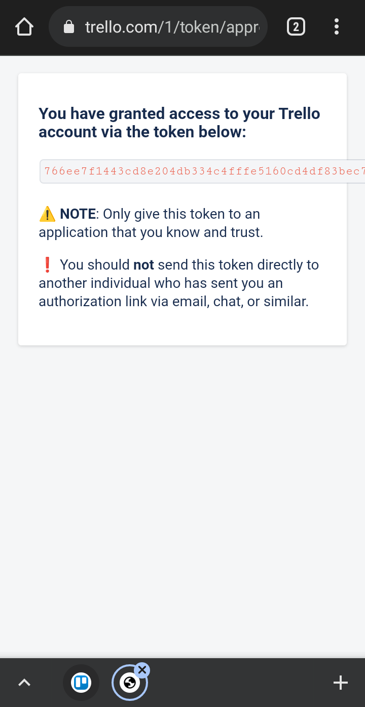

# SynTalk-push-action

Repository executed on Syntalk's private repo. It basically executes a JavaScript script that changes a trello roadmap.

## Setup

### Set up your repository

First of all, you need to make a workflow script where the script is executed.
Note: Script must run on `ubuntu-latest`

1- Create a file called `custom.yml` on `.github/workflows`

Example:
```
name: Change roadmap

on:
  push:
    branches: [ main ] # Set here the branches where the script is executed on push
    workflow_dispatch: # Leave this if you want to execute the script manually
    
jobs:
  deploy:
    runs-on: ubuntu-latest

    steps:
      - uses: actions/checkout@v2

      - name: Change Roadmap
        uses: migue802/SynTalk-push-action@v1.1
        with: 
          targetList: yourTargetListIDhere            # https://stackoverflow.com/a/50908600/14516042
          destinationList: yourDestinationListIDhere  # https://stackoverflow.com/a/50908600/14516042
          key: ${{ secrets.TRELLOKEY }}
          token: ${{ secrets.TRELLOTOKEN }}
```

2- Replace `targetList` and `destinationList` on the script

### Configuring the trello bot and repo secrets

Now to make the script work you must need to get a Trello account. You can get your personal account or make an ALT and invite it to the board (recommended in case the repo gets hacked).

#### Obtaining account key and token

1.- Make sure you logged in into the desired account

2.- Go to https://trello.com/app-key

3.- Accept _Trello Development Terms_


4.- Copy key and save it for later (in Notepad or Windows Sticky Notes) and then click _Token_ link


5.- You will see this access page. Just click _Authorize_


6.- Copy that long token and save it for later too



#### Configuring repo secrets

1.- Go to repo settings -> secrets

2.- Click new, title: `TRELLOKEY` and content is the key that you saved, then click save

3.- Here do the same but with `TRELLOTOKEN` and your token

4.- You're done! You can get rid of the key and token 


Congratulations! You configured the workflow. Now what you need to do is to make a push into the specified branches or execute it manually in the _Actions_ tab of your repo

----

© migue802, 2021-2022
